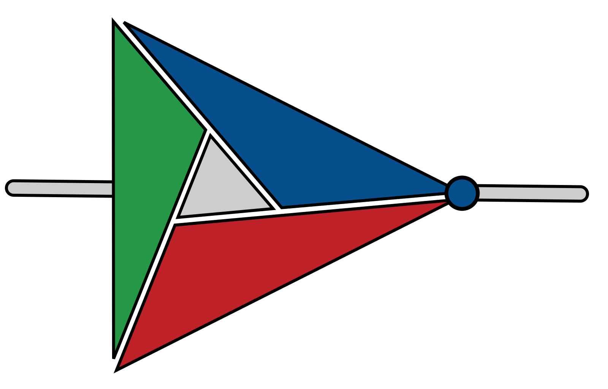

<h1 align="center">


  <a href="https://hep-soc.github.io/SoCMake/">Documentation</a> |
  <a href="https://github.com/HEP-SoC/SoCMake/tree/develop/examples">Examples</a>
</h1>


Introduction
------------

SoCMake is a library for CMake that adds support for hardware development.
It bridges the gap between software and hardware build flows, and allows for building complex System-on-Chip projects using a unified build system.

Unlike other hardware build systems, SoCMake reuses the mature CMake infrastructure instead of building it from scratch, benefiting from decades of development that went into CMake.

Features
--------

Comparing to other build systems, SoCMake's biggest strength is first class support for C,C++ compilation and cross-compilation.
SoCMake key features are:

* First class C, C++ compilation support
* Support for Cross-Compilation of (ARM, RiscV,...) application code.
* Extensive HDL simulation support (Verilog, SystemVerilog, VHDL)
* SystemC and SystemC-UVM support
* Mixed-language SV-VHDL-SC simulation
* Software and IP block package managment with CMake package managers
* HDL code generation and conversion (PeakRDL, desyrdl, yosys, sv2v, ..)
* Build graph generation with graphviz


Getting started
---------------

SoCMake is lightweight and has minimal dependencies.
The only mandatory dependencies are `CMake>=3.25.0` and `make` ([Install Dependencies](https://hep-soc.github.io/SoCMake/docs/getting_started))

There is no need to install SoCMake on your system, it is possible to fetch it in your `CMakeLists.txt`

Create a file called `CMakeLists.txt`

```CMake
# Bootstrap SoCMake into CMake project
include(FetchContent)
FetchContent_Declare(SoCMake
    GIT_REPOSITORY "https://github.com/HEP-SoC/SoCMake.git"
    GIT_TAG develop)
FetchContent_MakeAvailable(SoCMake)

cmake_minimum_required(VERSION 3.25) # CMake minimum required version
project(adder NONE)                  # Name of CMake project

# Create an IP block called adder
add_ip(adder)  
# Add verilog file adder.v to adder IP
ip_sources(adder VERILOG
                 ./adder.v)
# Create a target for Icarus Verilog
iverilog(adder)
```

The directory structure should be as following:

```
adder/
├── adder.v
└── CMakeLists.txt
```

In order to run the simulation execute the following:
```
mkdir build && cd build
cmake ../
make run_adder_iverilog
```

The following message should be printed:

```
[ 50%] Compile adder with iverilog
[ 50%] Built target adder_iverilog
[100%] Run iverilog testbench compiled from adder
Hello from Adder!
[100%] Built target run_adder_iverilog
```

Check out the [Documentation](https://hep-soc.github.io/SoCMake/)

Check out the [Pipeline Status (CDash)](https://my.cdash.org/index.php?project=SoCMake)
