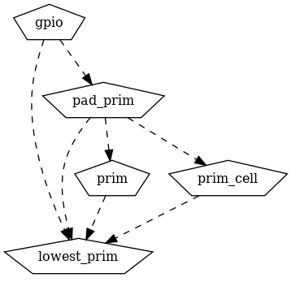

Build system
------------

Although CMake is primarily a build system for C/C++, it is possible to use it for general build system for any other language.
In order to do that in case of SoCMake, RTL libraries are described as `CMake Interface libraries <https://cmake.org/cmake/help/latest/command/add_library.html#interface-libraries>`_.
Interface libraries do not normally compile to any objects or executables, instead they are used only to carry files and information.

Although it is possible to define additional languages and compilers in CMake, in SoCMake for simplicity reasons approach of `add_custom_target() <https://cmake.org/cmake/help/latest/command/add_custom_target.html>`_  and `add_custom_command() <https://cmake.org/cmake/help/latest/command/add_custom_command.html>`_ is used to provide support for different tools like Verilator, Yosys, Vivado ...

Modern CMake encourages the use of Targets instead of setting global variables.
This way in SoCMake the way of passing different tool information and files along with your RTL libraries is by setting different `properties <https://cmake.org/cmake/help/latest/command/set_property.html>`_ to RTL library targets. For example if you want to add some SystemRDL files to your RTL library you can do the following:

.. literalinclude:: examples/linking/CMakeLists.txt
   :language: cmake

In this example we are creating ``gpio`` IP, with 2 SystemVerilog files ``gpio_core.sv`` and ``gpio.sv``, the order of definition of files is lowest hierarchy goes first, top module should be at the bottom of the list, because they will be passed to the tool in this order. Some tools do not care about order but others might.
We are also adding 2 rdl files by setting ``RDL_FILES`` property to the gpio library.

Additionally we are creating several sublibraries ``pad_prim``, ``prim``, ``prim_cell``, ``lowest_prim`` and we are describing dependencies between them with `target_link_libraries() <https://cmake.org/cmake/help/latest/command/target_link_libraries.html>`_.

It is important to undestand that the library gpio itself will not have all the sources from its linked library, but instead it will have a tree structure like in image above representing its linked libraries.
Traversing this tree its possible to extract the flat list of sources in proper dependency order.
The functions that will do that for you are: `get_rtl_target_property() <https://github.com/Risto97/SoCMake/blob/master/cmake/rtllib.cmake#L4>`_ or `get_rtl_target_sources() <https://github.com/Risto97/SoCMake/blob/master/cmake/rtllib.cmake#L23>`_.

The output of `message() <https://cmake.org/cmake/help/latest/command/message.html>`_ functions in this case is:

``JUST_GPIO_SOURCES: rtl/gpio_core.sv;rtl/gpio.sv``

``SOURCES: rtl/prim/lowest_prim.v;rtl/cells/prim_cell.v;rtl/prim/prim.v;rtl/pads/pad_prim.v;rtl/gpio_core.sv;rtl/gpio.sv``

As you can see the ``JUST_GPIO_SOURCES`` variable in this case holds only sources from gpio library, while ``SOURCES`` will have a flattened list of dependencies and all of the sources in proper order.

.. note::
   It is recommended to keep libraries in its separate directory and CMakeLists.txt file, to ease the reuse of them.

.. warning::
   At the moment it is recommended to use absolute paths to files, in previous example the use of ``${PROJECT_SOURCE_DIR}/rtl/gpio.sv`` would be prefered to ``rtl/gpio.sv``

